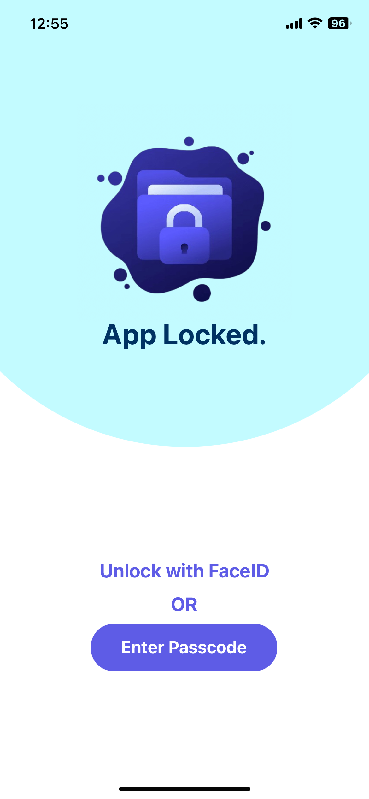
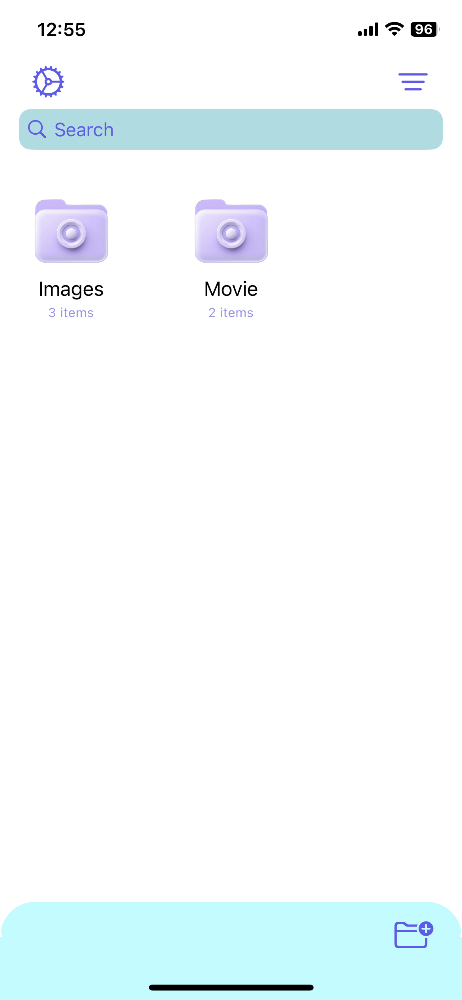
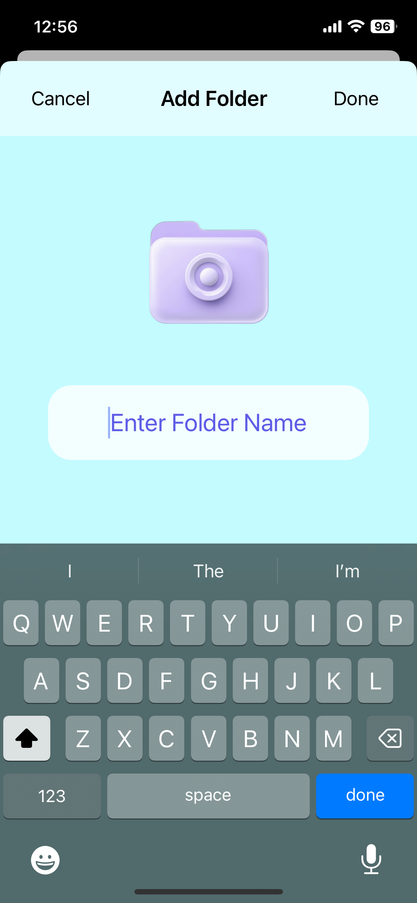
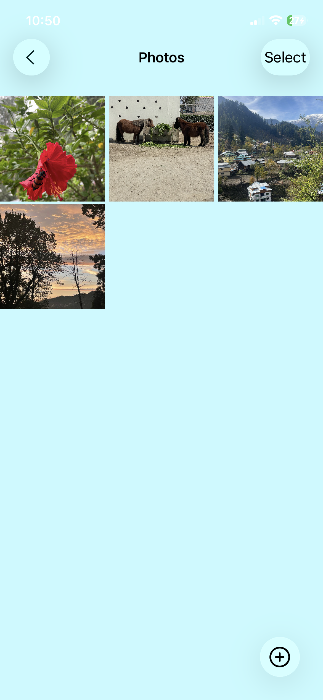

# 📱 Lock Folder App

A secure iOS application that allows users to lock and manage private photos, videos, and files using Face ID or a passcode.  
Built with **Swift** and **UIKit**, the app focuses on privacy, local data security, and smooth user experience.

---

## 🚀 Features
-  Create new folders to organize your private files  
-  Lock and unlock folders using Face ID or a custom passcode  
-  Import and organize photos & videos from the gallery  
-  Play locked videos securely within the app  
-  Data stored locally using Core Data (no cloud sync)  
-  Fully supports dark mode  

---

## 🧠 Tech Stack
- **Language:** Swift  
- **Frameworks:** UIKit, CoreData 
- **Architecture:** MVC  
- **Tools:** Xcode 15, iOS 16+  

---

## 🖼️ Screenshots

  
  
  
   
  

